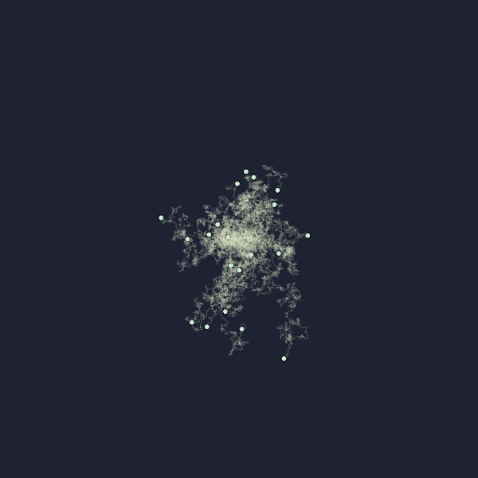

# Brownian Motion Simulation

This project demonstrates a simulation of Brownian motion using p5.js, visualizing particles moving randomly within a defined space.

## Description

The code simulates Brownian motion by creating a set number of particles that move randomly within the canvas. The visualization showcases these particles moving chaotically and leaving paths behind.

## Features

- **Brownian Motion Simulation**: Particles move randomly, simulating the erratic movement observed in Brownian motion.
- **Path Rendering**: Each particle leaves a fading path, depicting its path over time.
- **Customizable Parameters**: Easily adjust the number of particles and their behavior within the simulation.

## Usage

You can access the brownian simulator by clicking [here](https://editor.p5js.org/awakenedhaki/sketches/hC13xuybJ)!

- Modify the `nParticles` constant in `sketch.js` to change the number of particles simulated.
- Experiment with canvas size adjustments and particle behavior parameters to observe different simulations.

## Technologies Used

- [p5.js](https://p5js.org/): JavaScript library for creative coding and visualization.

## Preview

